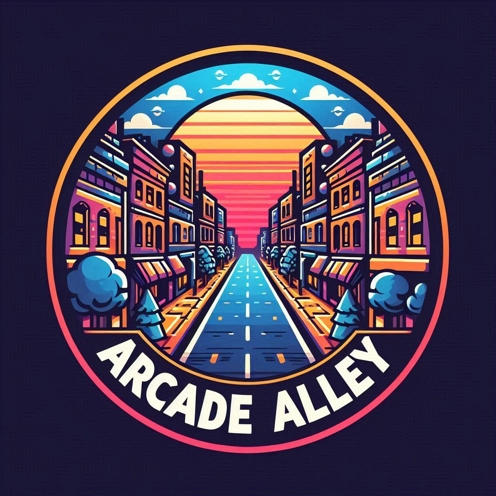

# Proyecto 1 DWEC
##                          Arcade Alley

## Indice
- [Proyecto 1 DWEC](#proyecto-1-dwec)
  - [Arcade Alley](#arcade-alley)
  - [Indice](#indice)
    - [Idea de la aplicacion](#idea-de-la-aplicacion)
    - [Audiencia objetivo](#audiencia-objetivo)
    - [Analisis de mercado y propuesta de valor](#analisis-de-mercado-y-propuesta-de-valor)
      - [Analisis de los rivales directos](#analisis-de-los-rivales-directos)
      - [Steam](#steam)
      - [Reddit](#reddit)
      - [Propuesta de diferenciación](#propuesta-de-diferenciación)
      - [Aportación de valor](#aportación-de-valor)
    - [Funcionalidades clave](#funcionalidades-clave)
    - [Tecnologias a utilizar](#tecnologias-a-utilizar)
    - [Modelos de arquitectura Cliente-Servidor](#modelos-de-arquitectura-cliente-servidor)
    - [Evaluación de los lenguajes de programación web seleccionados.](#evaluación-de-los-lenguajes-de-programación-web-seleccionados)
      - [HTML5](#html5)
      - [CSS3](#css3)
      - [React.js](#reactjs)
    - [Compatibilidad en Navegadores](#compatibilidad-en-navegadores)
      - [HTML5](#html5-1)
      - [CSS3](#css3-1)
      - [React.js](#reactjs-1)
    - [Cómo Afecta la Compatibilidad la Elección de Tecnologías](#cómo-afecta-la-compatibilidad-la-elección-de-tecnologías)
    - [Integración de lenguajes de programacion web y lenguajes de marcas](#integración-de-lenguajes-de-programacion-web-y-lenguajes-de-marcas)
      - [HTML y JavaScript](#html-y-javascript)
    - [Problemas Comunes y Soluciones](#problemas-comunes-y-soluciones)
    - [Evaluacion de React.js como herramienta para programacion web seleccionada](#evaluacion-de-reactjs-como-herramienta-para-programacion-web-seleccionada)
      - [Funciones Principales](#funciones-principales)
      - [Ventajas Distintivas](#ventajas-distintivas)
    - [Links de interes/referencias](#links-de-interesreferencias)
      - [APIs de Steam mencionadas en las funcionalidades clave](#apis-de-steam-mencionadas-en-las-funcionalidades-clave)
      - [API de Epic Games mencionada en funcionalidades clave](#api-de-epic-games-mencionada-en-funcionalidades-clave)
      - [Tecnologias y lenguajes de programacion web seleccionados](#tecnologias-y-lenguajes-de-programacion-web-seleccionados)
      - [Modelos Cliente-Servidor](#modelos-cliente-servidor)
      - [Compatibilidad en navegadores y consideraciones](#compatibilidad-en-navegadores-y-consideraciones)
      - [Integración](#integración)
      - [Evaluacion de React.js](#evaluacion-de-reactjs)
      
### Idea de la aplicacion
Una plataforma social para jugadores de videojuegos donde poder encontrar a gente con los mismos intereses, nivel de habilidad, horarios, preferencias, etc basado en un sistema de comunidades, ya sean publicas o privadas con contenido curado y moderado.


### Audiencia objetivo
Jugadores de videojuegos de cualquier plataforma actual y antigua con la necesidad de conocer o formar comunidades basadas en sus juegos favoritos.


### Analisis de mercado y propuesta de valor
#### Analisis de los rivales directos
#### Steam

**Fortalezas**:
Comunidad gigantesca de jugadores activos.
Sistema integrado con los juegos (listas de amigos, logros, mods, etc.).
Foros específicos para cada juego que facilitan la resolución de problemas y la interacción directa con desarrolladores.

**Debilidades**:
Las funciones sociales son secundarias; Steam se centra principalmente en la compra y distribución de juegos.
Las discusiones en los foros pueden ser desorganizadas o saturadas, lo que dificulta mantener la atención del usuario.
Falta de personalización en las interacciones sociales o sistemas complejos de interacción en tiempo real.

#### Reddit

**Fortalezas**
Comunidad masiva y diversa.
Amplia gama de subcomunidades dedicadas a juegos específicos.
Funcionalidad de votación que promueve el contenido relevante

**Debilidades**
Las funciones sociales son secundarias; Steam se centra principalmente en la compra y distribución de juegos.
Las discusiones en los foros pueden ser desorganizadas o saturadas, lo que dificulta mantener la atención del usuario.
Falta de personalización en las interacciones sociales o sistemas complejos de interacción en tiempo real.

#### Propuesta de diferenciación
- Integración de múltiples medios de interacción: Combinar lo mejor de los foros de discusión de Reddit (interacción estructurada, votaciones y publicaciones largas) y las funcionalidades de comunidad de Steam (sistemas de reseñas).

- Sistemas de recompensas y gamificación: Introducir un sistema de logros, recompensas o puntos por participar en la comunidad, algo que no está presente en Reddit o Steam de manera integrada. Esto puede incentivar el compromiso a largo plazo.


- Organización de eventos y torneos: Ofrecer funciones específicas para la organización de torneos y eventos en línea, lo cual es limitado en Reddit o Steam.


#### Aportación de valor
- Curación de contenido: Mientras que Reddit pueden ser caóticos y difíciles de seguir debido a la naturaleza abierta y desorganizada del contenido, Arcade Alley se podría centrar en la curación de contenido de calidad, destacando las mejores guías, reseñas y discusiones. 
  
  Ejemplo: Moderadores o algoritmos que identifiquen contenido valioso y lo presenten de manera prominente, lo que aumenta la visibilidad y utilidad de las publicaciones importantes.
- Herramientas sociales mejoradas: Mientras que Steam se centra principalmente en la funcionalidad básica de amigos y comunicación, Arcade Alley podría centrarse en un enfoque más profundo en las conexiones sociales entre jugadores.
  
  Ejemplo: Perfiles de jugadores más avanzados, con estadísticas, historia de juegos jugados, recomendaciones personalizadas de amigos y eventos.

- Multiplataforma con integración social: Facilitar una mejor integración entre plataformas. Si bien Steam ofrece funcionalidades limitadas en dispositivos móviles, una plataforma web optimizada para móvil con un enfoque en comunidad podría llenar este vacío.
  
  Ejemplo: Posibilidad de sincronizar cuentas de Steam y otros servicios, permitiendo una experiencia social unificada y centralizada.

### Funcionalidades clave
1. Creacion de cuentas

    Sea mediante el clasico correo electronico + contraseña o aprovechando la API de Steam y usando su sistema de login para vincular la cuenta de Steam a la de Arcade Alley.

2. Panel de control de usuario

    Lugar donde ver y editar los detalles que se muestren o no al publico en tu perfil de usuario.


3. Sistema de comunidades

    Siguiendo un poco los modelos de Steam y Reddit en tanto en cuanto a que están divididas por tematica especifica o por videojuego.

4. Buscador / Boton de "Recomiendame una comunidad nueva".
    
    Las comunidades tendrán una puntuacion que los usuarios iran granjeando cumpliendo ciertos criterios de actividad de sus juegos recientes mediante la API de Steam, retos propuestos a las comunidades, etc. Al pulsar dicho boton de recomendación o buscar comunidades por un juego concreto, las comunidades con mayor puntuacion tendrán mayor posibilidad de aparecer recomendadas antes que otras 

    Esta puntuación se reseteará cada primero de mes.

5. Gestor de comunidades

    Los administradores/creadores de las comunidades podrán hacerlas publicas o privadas mediante un sistema whitelist de peticion de admision donde recibirán un informe completo de la cuenta del usuario solicitante donde podrán ver un historial de comportamiento entre otros datos.

6. Sistema de logros
    
    Sistema de logros que se irán adquiriendo con la veteranía en Arcade Alley o mediante completar retos o actividad reciente, datos de los juegos que tengan en la cuenta de Steam mediante su API si el perfil fuese publico etc.


### Tecnologias a utilizar
Front-end:
- HTML5
  

- CSS3
  

- React.js


Back-end:
- BD con MongoDB


- Java SpringBoot


### Modelos de arquitectura Cliente-Servidor
- Modelo Cliente-Servidor centralizado
  
  Modelo más básico y común. Los clientes (usuarios o dispositivos) se conectan a un servidor central que proporciona recursos o servicios. El servidor maneja todas las peticiones y envía respuestas a los clientes.
  Ejemplo: Aplicaciones web tradicionales (por ejemplo, una página web donde el servidor gestiona la lógica y la base de datos).

  - Ventajas
    
    - Sencillo y fácil de implementar; todos los datos y recursos están centralizados.

  - Desventajas

    - Si el servidor falla, todos los clientes quedan desconectados.

- Modelo Cliente-Servidor multicapa
   Este modelo introduce más capas entre el cliente y el servidor, típicamente tres:
  
  - Capa de presentación (interfaz de usuario).
  
  - Capa de lógica de negocio (donde se gestionan las reglas de negocio y procesamiento).
  
  - Capa de datos (base de datos o almacenamiento).
  
  Ejemplo: Una aplicación web con una interfaz de usuario, un servidor de aplicaciones para la lógica de negocio, y una base de datos para almacenar información.

  - Ventajas
  
    - Mejora la modularidad y escalabilidad, facilita la distribución de carga, y permite la reutilización de componentes.

  - Desventajas

    - Mayor complejidad en el diseño y desarrollo.
    
- Modelo Peer-to-Peer
  
  En este modelo, no hay un servidor central, sino que cada nodo (cliente) actúa tanto como cliente y servidor. Los nodos se comunican directamente entre sí, compartiendo recursos de manera distribuida.
  
  Ejemplo: Redes de intercambio de archivos (como BitTorrent), aplicaciones de mensajería descentralizadas.

  - Ventajas: 

    - Alta disponibilidad y tolerancia a fallos, ya que no depende de un único servidor central.
  - Desventajas:
  
    - Complejidad en la gestión de nodos, distribución de recursos, y seguridad.

### Evaluación de los lenguajes de programación web seleccionados.

#### HTML5

- Ventajas:

  - Fácil de aprender: HTML5 tiene una sintaxis clara y sencilla.
  - Compatibilidad: Es compatible con todos los navegadores modernos.
  - Multimedia: Soporta elementos multimedia como audio y video sin necesidad de plugins adicionales.
  - Accesibilidad: Mejora la accesibilidad y la semántica del contenido web1.
- Desventajas:

  - Limitaciones en diseño: Aunque es potente, HTML5 tiene limitaciones en cuanto a diseño y funcionalidad avanzada.
  - Seguridad: Puede ser vulnerable a ciertos tipos de ataques si no se implementa correctamente.
#### CSS3


  - Ventajas:

    - Separación de contenido y presentación: Permite separar la estructura del contenido de su presentación visual.
    - Diseño avanzado: Introduce nuevas características y mejoras que amplían las posibilidades de diseño.
    - Compatibilidad: Es compatible con la mayoría de los navegadores modernos.
    - Animaciones y transiciones: Facilita la creación de animaciones y transiciones sin necesidad de JavaScript4.
- Desventajas:

  - Compatibilidad con navegadores antiguos: Algunas características de CSS3 no son compatibles con navegadores más antiguos.
  - Complejidad: Puede volverse complejo y difícil de mantener en proyectos grandes4.

    
#### React.js

- Ventajas:

  - Componentización: Facilita la creación de interfaces de usuario mediante componentes reutilizables5.
  - Rendimiento: Utiliza un DOM virtual que mejora el rendimiento de las aplicaciones5.
  - Comunidad y soporte: Tiene una gran comunidad y soporte, lo que facilita encontrar recursos y soluciones5.
  - SEO amigable: Permite la renderización del lado del servidor, mejorando el SEO5.
 
- Desventajas:

  - Curva de aprendizaje: Puede tener una curva de aprendizaje pronunciada para principiantes5.
  - Actualizaciones frecuentes: Las actualizaciones y cambios frecuentes pueden requerir ajustes constantes en el código.
  - Dependencia de JavaScript: Requiere un buen conocimiento de JavaScript para aprovechar al máximo sus capacidades.

### Compatibilidad en Navegadores


#### HTML5
- Problemas:

  - Compatibilidad parcial: Algunas características avanzadas de HTML5 pueden no ser compatibles con navegadores más antiguos.
  - Implementación inconsistente: Diferentes navegadores pueden interpretar y renderizar elementos HTML5 de manera diferente.
- Soluciones:

  - Polyfills: Utilizar polyfills para añadir soporte a navegadores que no soportan ciertas características.
  - Pruebas exhaustivas: Realizar pruebas en múltiples navegadores para asegurar una experiencia consistente.
 
    
#### CSS3
- Problemas:

  - Prefijos de vendedor: Algunas propiedades de CSS3 requieren prefijos específicos para funcionar en diferentes navegadores.
  - Compatibilidad con navegadores antiguos: No todas las características de CSS3 son compatibles con navegadores más antiguos.
- Soluciones:

  - Prefijos de vendedor: Utilizar prefijos de vendedor como -webkit-, -moz-, -ms-, y -o- para asegurar compatibilidad.
  - Reset CSS: Utilizar un archivo de reset CSS para normalizar el estilo en todos los navegadores.


#### React.js
- Problemas:

  - Compatibilidad con navegadores antiguos: Algunas características de JavaScript utilizadas por React.js pueden no ser compatibles con navegadores más antiguos.
  - Rendimiento: El rendimiento puede variar dependiendo del navegador y la versión.
- Soluciones:

  - Transpiladores: Utilizar herramientas como Babel para transpilar el código de JavaScript moderno a una versión compatible con navegadores más antiguos.
  - Pruebas de rendimiento: Realizar pruebas de rendimiento en diferentes navegadores para identificar y solucionar problemas.
 
### Cómo Afecta la Compatibilidad la Elección de Tecnologías
La compatibilidad de navegadores es un factor crucial a la hora de elegir tecnologías para el desarrollo web. 

Algunas consideraciones podrían ser las siguientes:

  - Audiencia objetivo: Si tu audiencia utiliza principalmente navegadores modernos, puedes aprovechar las últimas tecnologías sin preocuparte demasiado por la compatibilidad.
  - Soporte a largo plazo: Elegir tecnologías con buen soporte y actualizaciones frecuentes puede ayudar a mantener la compatibilidad a lo largo del tiempo.
  - Herramientas y frameworks: Utilizar herramientas y frameworks que faciliten la compatibilidad entre navegadores puede reducir significativamente los problemas.

### Integración de lenguajes de programacion web y lenguajes de marcas
#### HTML y JavaScript
- Integración Directa:

  - Script Tags: La forma más común de integrar JavaScript en HTML es mediante el uso de etiquetas script. 
  ```
  <script>
      // Código JavaScript aquí
  </script>
  <script src="script.js"></script>
  ```
- Manipulación del DOM:

  - Document Object Model (DOM): JavaScript puede manipular el DOM para cambiar la estructura, el estilo y el contenido de una página web en tiempo real. Esto permite crear interfaces de usuario dinámicas e interactivas.
  
  ```
  document.getElementById("miElemento").innerHTML = "Nuevo contenido";
  ```

- Eventos:

  - Manejo de Eventos: JavaScript puede responder a eventos del usuario, como clics, movimientos del ratón y teclas presionadas, para actualizar la interfaz de usuario de manera dinámica.
  ```
  document.getElementById("miBoton").addEventListener("click", function() {
  alert("Botón clickeado!");
  });

  ```

### Problemas Comunes y Soluciones
- Problemas:

  - Compatibilidad de Navegadores: Diferentes navegadores pueden interpretar y ejecutar el código de manera diferente, lo que puede causar inconsistencias.
  - Seguridad: La inclusión de JavaScript en HTML puede exponer la página a ataques como Cross-Site Scripting (XSS).
- Soluciones:

  - Polyfills: Como se mencionó antes, utilizar polyfills en HTML5 para añadir soporte a navegadores que no soportan ciertas características.
  - Pruebas Exhaustivas: Realizar pruebas en múltiples navegadores para asegurar una experiencia consistente.
  - CSP (Content Security Policy): Implementar políticas de seguridad para mitigar riesgos de XSS.

### Evaluacion de React.js como herramienta para programacion web seleccionada

#### Funciones Principales

  - Componentes Reutilizables: React permite crear componentes que se pueden reutilizar en diferentes partes de la aplicación, lo que facilita el mantenimiento y la escalabilidad.
  - Virtual DOM: Utiliza un DOM virtual para mejorar el rendimiento. En lugar de actualizar el DOM real directamente, React realiza cambios en el DOM virtual y luego sincroniza estos cambios con el DOM real de manera eficiente.
  - JSX: Una extensión de la sintaxis de JavaScript que permite escribir HTML dentro de JavaScript. Esto hace que el código sea más legible y fácil de escribir.
  - Unidirectional Data Flow: React sigue un flujo de datos unidireccional, lo que significa que los datos fluyen en una sola dirección, facilitando la gestión del estado de la aplicación.

#### Ventajas Distintivas

  - Rendimiento: Gracias al Virtual DOM, React puede actualizar y renderizar componentes de manera eficiente, lo que mejora el rendimiento de la aplicación.
  - Ecosistema y Comunidad: React tiene una gran comunidad de desarrolladores y un ecosistema robusto de herramientas y bibliotecas, como Redux para la gestión del estado y React Router para la navegación.
  - Flexibilidad: React es una biblioteca, no un framework completo, lo que permite integrarlo fácilmente con otras bibliotecas o frameworks según las necesidades del proyecto.
  - Desarrollo Basado en Componentes: La arquitectura basada en componentes facilita la reutilización de código y la separación de preocupaciones, lo que resulta en un código más limpio y mantenible.


### Links de interes/referencias

#### APIs de Steam mencionadas en las funcionalidades clave

- [API Steam](https://steamcommunity.com/dev?l=spanish)
- [API ISteamNews](https://developer.valvesoftware.com/wiki/Steam_Web_API#GetNewsForApp_.28v0001.29)
- [API ISteamUserStats](https://developer.valvesoftware.com/wiki/Steam_Web_API#GetGlobalAchievementPercentagesForApp_.28v0001.29)
- [API ISteamUser ](https://developer.valvesoftware.com/wiki/Steam_Web_API#GetPlayerSummaries_.28v0001.29)
  
#### API de Epic Games mencionada en funcionalidades clave

- [API Free Epic Games](https://rapidapi.com/kwik-api-kwik-api-default/api/free-epic-games)
- [APIs generales de Epic Games](https://dev.epicgames.com/docs/web-api-ref)
  
#### Tecnologias y lenguajes de programacion web seleccionados

- [HTML5](https://ebac.mx/blog/que-es-html5)
- [CSS3](https://www.dongee.com/tutoriales/ventajas-y-desventajas-de-css3/)
- [React.js](https://cink.es/blog/beneficios-de-react-js-para-aplicaciones/)

#### Modelos Cliente-Servidor

- [Cliente-Servidor tradicional](https://www.ionos.es/digitalguide/servidores/know-how/modelo-cliente-servidor/)
- [Cliente-Servidor multicapa](https://www.tecnologias-informacion.com/arquitectura-servidores.html)
- [Peer-to-Peer](https://reactiveprogramming.io/blog/es/estilos-arquitectonicos/p2p)

#### Compatibilidad en navegadores y consideraciones

- [Compatibilidad de HTML5 y CSS3](https://www.solucionex.com/blog/compatibilidades-de-html5-y-css3-en-los-navegadores)
- [Compatibilidad de React.js](https://es.legacy.reactjs.org/docs/javascript-environment-requirements.html)
- [Problemas y soluciones de compatibilidad](https://desarrolladoraweb.com/blog/como-solucionar-problemas-de-compatibilidad-css-en-diferentes-navegadores)
- [Por qué es importante la compatibilidad al escoger tecnologias web](https://publica.com.mx/blog/que-es-la-compatibilidad-entre-navegadores)

#### Integración

- [Polyfills](https://developer.mozilla.org/es/docs/Glossary/Polyfill)
- [CSP](https://developer.mozilla.org/en-US/docs/Web/HTTP/CSP)

#### Evaluacion de React.js

- [React.js ventajas e inconvenientes](https://www.solbyte.com/blog/react-js-ventajas-e-inconvenientes/)
- [Documentacion de React.js](https://es.react.dev/)
